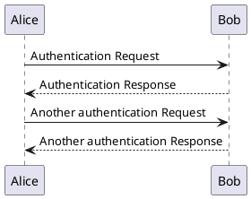

# TaskCompletionSource cancel
TaskCompletionSource 是用來把EAP to TAP的重要元件
網路上的程式多半是http,這次就寫個SerialPort
```csharp
public class Telnet_SerialPort
{
    
}
SerialPort m_Port = new SerialPort("COM1");

void Desbounce()
{
    
}

```